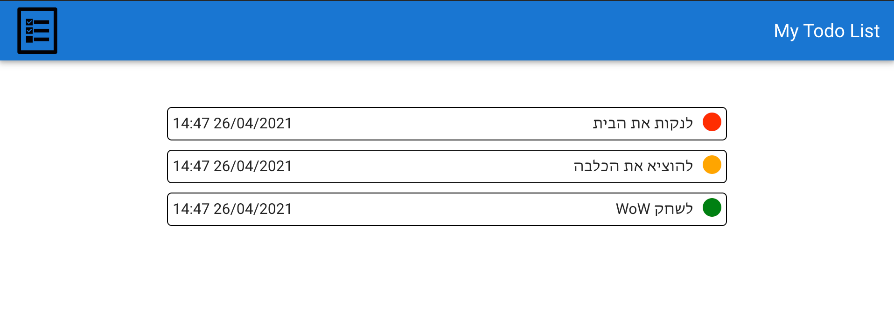
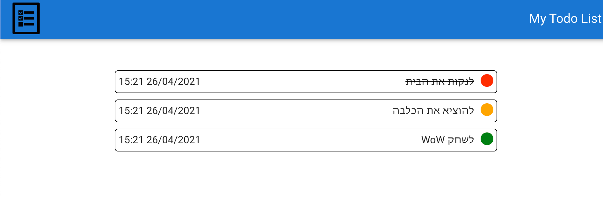

### Setup
```
# Run the client
npm install
npm start

# Run the server
cd server
npm install
npm start
```

# React Exercise

1. Implement `TodoList.vue` so it would look like this:

   

   **Guidelines:**
    * You can start with the TodoList.js component in src/components
    * If you add any component, add it in the same directory

2. Add a way to toggle tasks between done and not done:

    

3. Show an encouragement message when all tasks are done.

4. Add a way to add a todo item to the list

5. Use the server api to get the todo list from the DB, remove a todo item completly and add one.

// 0535306838